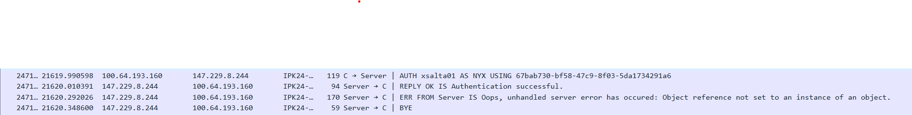
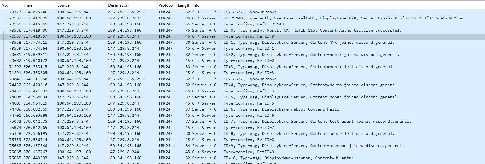

# README ipk24-chat-client documentation

## Content structuring
- [Theory](#theory)
- [Narrative: TCP Logic](#narrative-tcp-logic)
- [Narrative: UDP Logic](#narrative-udp-logic)
- [Testing](#testing)
- [License](#license)
- [Used sources](#used-sources)
## Theory
The task was to create a client application to interact with a remote server using the IPK24-CHAT protocol, which has two variants based on different transport protocols. The goal was to implement both variants.

As for TCP, the stages of connection establishing are:
- Getting server address using DNS
- Finding IP address of server
- Socket creation
- Connecting to server
- Sending message to server
- Receiving the answer
- Communicating until "BYE", Ctrl-C or Ctrl-Z signal received
- Closing the socket

For UDP:
- Getting server address using DNS
- Finding IP address of server
- Socket creation
- Sending message to server
- Receiving the confirmation
- Receiving the answer
- Sending the confirmation
- Communicating until "BYE", Ctrl-C or Ctrl-Z signal received

It means that the main difference of TCP from UDP is that UDP does not connect to the server, but right away sends data.

## Narrative: TCP Logic

1. **Argument Parsing:**
    - Parse command line arguments to determine the transport protocol (TCP or UDP).

2. **Transport Protocol Check:**
    - If the transport protocol is TCP, execute logic for TCP.

3. **Connect to Server:**
    - Establish a connection to the remote server.

4. **Parallel Execution:**
    - Execute two parallel processes: `sendTask` and `receiveTask`.

5. **sendTask:**
    - Continuously loop:
        - Read input from the user.
        - Parse the input.
        - Convert the input into bytes for sending to the server.
        - Send the command to the server.

6. **receiveTask:**
    - Receive messages from the server.
    - Parse the received message.
    - React based on the message type.

7. **Program Termination:**
    - Terminate the program gracefully upon receiving Ctrl+C, Ctrl+Z, or the "BYE" command from the user.

## Narrative: UDP Logic

1. **Argument Parsing:**
    - Parse command line arguments to determine the transport protocol (TCP or UDP).

2. **Transport Protocol Check:**
    - If the transport protocol is UDP, execute logic for UDP.

3. **Create UDP Client:**
    - Initialize a UDP client for communication with the server.

4. **Binding:**
    - Bind the UDP client to a specific local endpoint using the `Bind` method. Binding allows the client to receive incoming datagrams on the specified port.

5. **Background Receive Process:**
    - Launch a background task `ReceiveAsync` to handle incoming messages from the server.
        - Inside the loop:
            - Receive packets from the server.
            - Parse the received packets.
            - Determine the message type.
            - If the message type is CONFIRM, take no action. Otherwise, construct a CONFIRM packet and send it to the server.
            - Output relevant information to the console based on the message type using the `UdpMessagePrinter` class constructor.

6. **Main Program Loop:**
    - Execute a while loop in the main program:
        - Read user input.
        - Analyze input based on the first word.
        - Construct packets for /auth, /join, /msg in the format specified in the protocol using the `UdpMessageBuilder` class constructor.
        - Implement corresponding logic for /help and /rename.
        
7. **Send Packets to Server:**
    - Send the constructed packets to the server.

8. **Program Termination:**
    - Terminate the program gracefully upon receiving Ctrl+C, Ctrl+Z, or the "BYE" command from the user.

## Testing

#### Testing Environment:
- Operating System: Windows 11, Ubuntu 22.04.
- Programming Language: C#
- Development Environment: JetBrains Rider 2023.3.3
- Server: A remote server running the IPK24-CHAT protocol
- Network Topology: Client-server communication over TCP and UDP protocols

During testing and debugging, the following tools were utilized:

- **Netcat (nc):** Netcat was used for TCP communication testing. It allowed for manual interaction with the server, sending custom messages, and observing server responses.

- **Wireshark:** Wireshark was employed to analyze network traffic and understand the communication process between the client and the server. It helped in identifying any anomalies or unexpected behaviors in the network packets. Wireshark had a good view of exactly what was being sent by the server and in what sequence, how my application reacted to the incoming packets, and how the server reacted to the packets sent by the application.

### Test Cases

#### Basic Communication Test

- **Description:** Tests if the client can establish a connection with the server and send/receive messages.
- **Inputs:** User inputs "/auth username" command.
- **Expected Output:** Client sends an authentication message to the server. Server responds with a confirmation message.
- **Actual Output:** Client successfully connects to the server and receives a confirmation message.

#### Error Handling Test

- **Description:** Tests if the client properly handles invalid commands and error responses from the server.
- **Inputs:** User inputs an invalid command or the server responds with an error message.
- **Expected Output:** Client displays an error message indicating the invalid command or the reason for the error response from the server.
- **Actual Output:** Client correctly handles invalid inputs and error responses from the server.

#### Termination Test

- **Description:** Tests if the client terminates gracefully upon receiving termination signals (Ctrl+C, Ctrl+Z) or the "BYE" command from the user.
- **Inputs:** User inputs Ctrl+C, Ctrl+Z, or the "BYE" command.
- **Expected Output:** Client terminates without errors and closes the connection with the server.
- **Actual Output:** Client successfully terminates upon receiving termination signals or the "BYE" command.

## License
This project is licensed under the [GNU GENERAL PUBLIC LICENSE v3](https://www.gnu.org/licenses/gpl-3.0.html).

## Used sources
Microsoft. "C# programming guide." .NET Documentation. [Online]. Available: https://learn.microsoft.com/en-us/dotnet/csharp/.